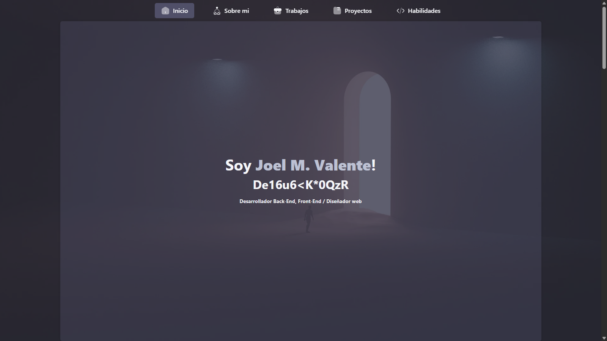

# Portfolio v2.0

Portfolio construido solo con **HTML5**, **CSS3** y **JAVASCRIPT**, este cuenta con algunas secciones aunque no le he agregado la sección de servicios.

## Sistema de contacto
El formulario funciona gracias a [emailjs][emailjs]

## Tipos de modos
 * Light/Dark

### Imagenes utilizadas
 * Header: Foto de [Blake Connally][@blakeconnally] en [Unsplash][urlunsplash]

### Redes 
 * 💻 [Linkedin](https://www.linkedin.com/in/joelmiguelvalente)
 * 💻 [Discord](https://discord.com/users/465203938900049920)
 * 💻 [X](https://x.com/JValenteM92)

[emailjs]: https://www.emailjs.com/

[@blakeconnally]: https://unsplash.com/es/@blakeconnally?utm_content=creditCopyText&utm_medium=referral&utm_source=unsplash
[urlunsplash]: https://unsplash.com/es/s/fotos/codigo?utm_source=unsplash&utm_medium=referral&utm_content=creditCopyText